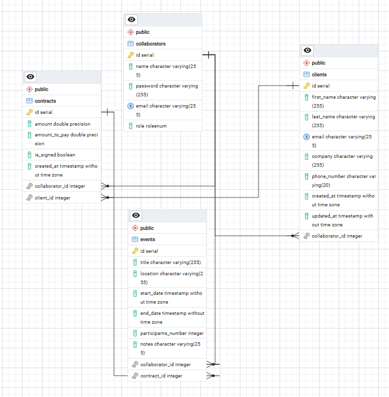

# Epic Events CRM

Application de gestion de la relation client (CRM) en ligne de commande, développée dans le cadre du projet P12 OpenClassrooms.

## Stack technique

- **Python 3.14+**
- **SQLAlchemy** — ORM
- **PostgreSQL** — base de données
- **Click** — interface CLI
- **PyJWT** — authentification par tokens
- **Argon2** — hachage des mots de passe
- **Sentry** — monitoring des erreurs

## Architecture

Le projet suit le pattern **MVC** avec une séparation stricte des responsabilités :

```
P12-epic_events/
├── epicevent/
│   ├── __main__.py                   # point d'entrée CLI (Click) + Sentry + création des tables
│   ├── commands/
│   │   ├── auth_command.py           # login / logout
│   │   ├── client_command.py         # clients list/add/update
│   │   ├── collaborators_command.py  # collaborators list/add/update/delete
│   │   ├── contract_command.py       # contracts list/add/update/sign
│   │   └── event_command.py          # events list/add/update/assign
│   ├── models/
│   │   ├── base.py                   # Base SQLAlchemy + engine + Session
│   │   ├── collaborators.py          # Collaborator, RoleEnum
│   │   ├── clients.py                # Client
│   │   ├── contracts.py              # Contract
│   │   └── events.py                 # Event
│   ├── services/
│   │   ├── auth_service.py           # authentification
│   │   ├── clients_service.py
│   │   ├── collaborators_service.py
│   │   ├── contracts_service.py
│   │   └── events_service.py
│   └── utils/
│       ├── decorators.py             # @login_required, @roles_required
│       └── token.py                  # get_token / verify_token (JWT)
├── tests/
│   ├── conftest.py                   # fixtures partagées (session, utilisateurs, objets)
│   ├── test_models/
│   │   ├── test_collaborator.py
│   │   ├── test_client.py
│   │   ├── test_contract.py
│   │   └── test_event.py
│   ├── test_services/
│   │   ├── test_auth_service.py
│   │   ├── test_clients_service.py
│   │   ├── test_collaborators_service.py
│   │   ├── test_contracts_service.py
│   │   └── test_events_service.py
│   └── test_utils/
│       └── test_token.py
├── docs/
│   └── erd.png                       # diagramme entité-relation
├── pyproject.toml
├── requirements.txt
└── uv.lock
```

### Système de permissions

Deux niveaux de contrôle d'accès :

- `@roles_required("gestion", "commercial")` — vérifie le rôle du collaborateur connecté
- `can_edit(collaborator)` dans les models — vérifie la propriété de l'objet (appelé dans les commandes)

## Schéma de la base de données



## Installation

### Prérequis

- Python 3.14+
- PostgreSQL installé et en cours d'exécution

### Créer la base de données

```bash
psql -U postgres
CREATE DATABASE epic_events_db OWNER postgres;
\q
```

### Variables d'environnement

Créez un fichier `.env` à la racine du projet :

```env
DB_USER=postgres
DB_PASSWORD=votre_mot_de_passe
DB_HOST=localhost
DB_PORT=5432
DB_NAME=epic_events_db
JWT_SECRET_KEY=votre_clé_secrète_32_caractères_minimum
SENTRY_DSN=votre_dsn_sentry
```

---

### Option 1 — Installation avec `uv` (recommandée)

[uv](https://github.com/astral-sh/uv) est un gestionnaire de packages Python rapide.

```bash
# Installer uv si pas déjà installé
pip install uv

# Créer l'environnement virtuel et installer les dépendances
uv venv
uv sync

# Activer l'environnement
# Windows
.venv\Scripts\activate
# Linux / macOS
source .venv/bin/activate

# Installer le projet en mode éditable
uv pip install -e .
```

### Option 2 — Installation avec `pip`

```bash
# Créer et activer l'environnement virtuel
python -m venv .venv

# Windows
.venv\Scripts\activate
# Linux / macOS
source .venv/bin/activate

# Installer les dépendances
pip install -r requirements.txt

# Installer le projet en mode éditable
pip install -e .
```

---

## Initialisation

### 1. Créer les tables

À la première exécution, SQLAlchemy crée automatiquement toutes les tables :

```bash
epicevent
```

### 2. Créer le premier collaborateur

La base de données étant vide, il faut créer le premier collaborateur de type `gestion` manuellement. Dans `__main__.py`, décommentez le bloc suivant, relancez `epicevent`, puis recommentez :

```python
# with Session() as session:
#     test_collab = Collaborator(
#         name="Alice",
#         email="alice@epic.io",
#         role=RoleEnum.gestion
#     )
#     test_collab.set_password("password123")
#     session.add(test_collab)
#     session.commit()
```

Une fois connecté avec ce compte `gestion`, vous pouvez créer les autres collaborateurs via :

```bash
epicevent collaborators add
```

---

## Commandes disponibles

### Authentification

```bash
epicevent login       # Se connecter
epicevent logout      # Se déconnecter
```

### Collaborateurs — rôle : gestion

```bash
epicevent collaborators list      # Lister tous les collaborateurs
epicevent collaborators add       # Ajouter un collaborateur
epicevent collaborators update    # Modifier un collaborateur
epicevent collaborators delete    # Supprimer un collaborateur
```

### Clients — rôle : commercial

```bash
epicevent clients list            # Lister tous les clients
epicevent clients add             # Ajouter un client
epicevent clients update          # Modifier un client (responsable uniquement)
```

### Contrats — rôle : gestion / commercial

```bash
epicevent contracts list          # Lister tous les contrats
epicevent contracts list --unsigned # Contrats non signés (commercial)
epicevent contracts list --unpaid   # Contrats non payés (commercial)
epicevent contracts add           # Ajouter un contrat (gestion)
epicevent contracts update        # Modifier un contrat (propriétaire uniquement)
epicevent contracts sign          # Signer un contrat (gestion)
```

### Événements — rôle : commercial / support / gestion

```bash
epicevent events list             # Lister tous les événements
epicevent events list --no-support # Événements sans support (gestion)
epicevent events list --mine       # Mes événements (support)
epicevent events add              # Créer un événement (commercial)
epicevent events update           # Modifier un événement (support assigné)
epicevent events assign           # Assigner un support à un événement (gestion)
```

---

## Tests

Les tests utilisent **SQLite en mémoire** — aucune configuration de base de données nécessaire.

```bash
# Lancer les tests
pytest

# Avec le rapport de coverage
pytest --cov=epicevent --cov-report=term-missing
```

Coverage actuel : **94%** sur models, services et utils.

## Qualité du code

```bash
# Vérifier avec ruff
uv tool run ruff check epicevent/

# Corriger automatiquement
uv tool run ruff check epicevent/ --fix
```
